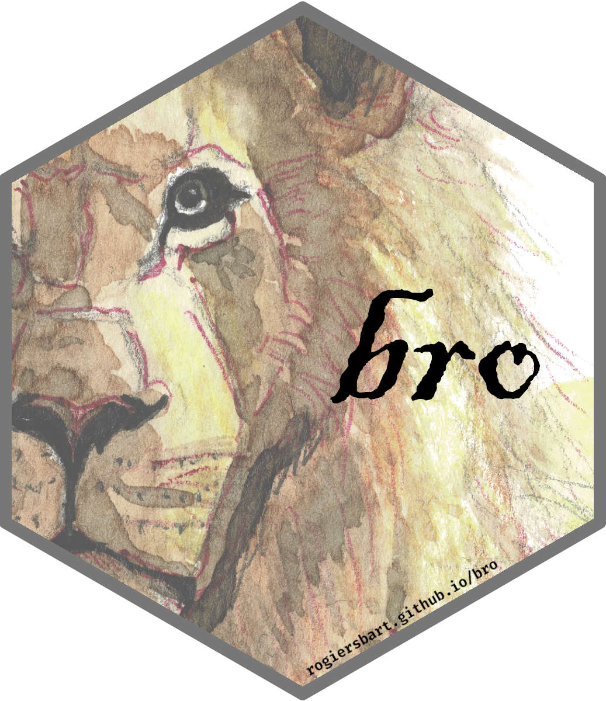

<!-- README.md is generated from README.Rmd. Please edit that file -->

```{r, include = FALSE}
knitr::opts_chunk$set(
  collapse = TRUE,
  comment = "#>",
  fig.path = "man/figures/README-",
  out.width = "100%"
)
```

# The {bro} R package<br><small><font color="#999">My personal R tools</font></small>

<!-- badges: start -->
[](https://www.tidyverse.org/lifecycle/#experimental)
[](https://CRAN.R-project.org/package=bro)
<!-- badges: end -->

The {[bro](https://rogiersbart.github.io/bro)} R package collects some functions
I created for myself to facilitate certain tasks. I do not expect it to be very
useful for anyone else, but if you think this can help you out, be my guest!

# Install

You can install the latest version of
{[bro](https://rogiersbart.github.io/bro)} with the following:

```{r eval = FALSE}
if (!require(pak)) install.packages("pak")
pak::pak("rogiersbart/bro")
```

# Use

# Note

The package logo is a
[derivative](https://rogiersbart.github.io/espresso/index.html#/leo) of my [CC
BY 4.0](https://creativecommons.org/licenses/by/4.0)-licensed
[espresso](https://rogiersbart.github.io/espresso) project, and I was born when
the sun was in front of the Leo constellation.
